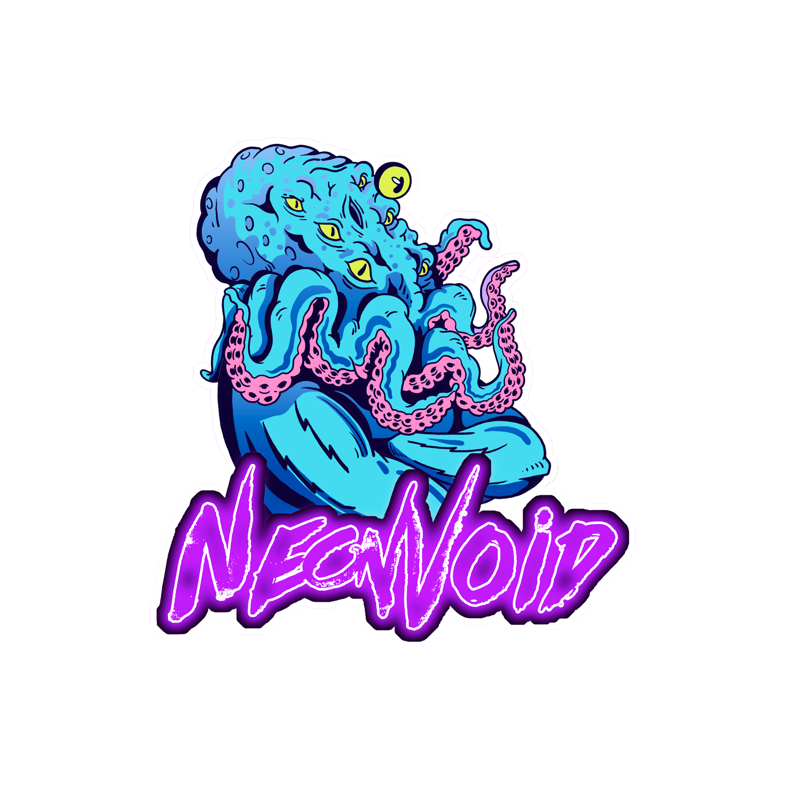

<i>🐙 We live on a placid island of ignorance in the midst of black seas of infinity, and it was not meant that we should voyage far.</i>
---



<p align="left">Founder of <a href="https://github.com/eldritch-theme/eldritch">Eldritch</a></p>

```typescript
let neonvoid: Dev = {
  currentFocus: [
    "Learning Rust",
  ],
  languages: [
    "Typescript",
    "Bash", 
    "C#"
    "Lua", 
    "VB.NET"
    "Python", 
    "Java"
  ],
  tools: [Jest, Playwright, Terraform],
  setup: {
    os: "Arch",
    wm: "Hyprland",
    gpu: "AMD 9070XT",
    cpu: "AMD Ryzen 9 9950X3D",
    editor: "nvim"
  }
}
```

---


&nbsp;

